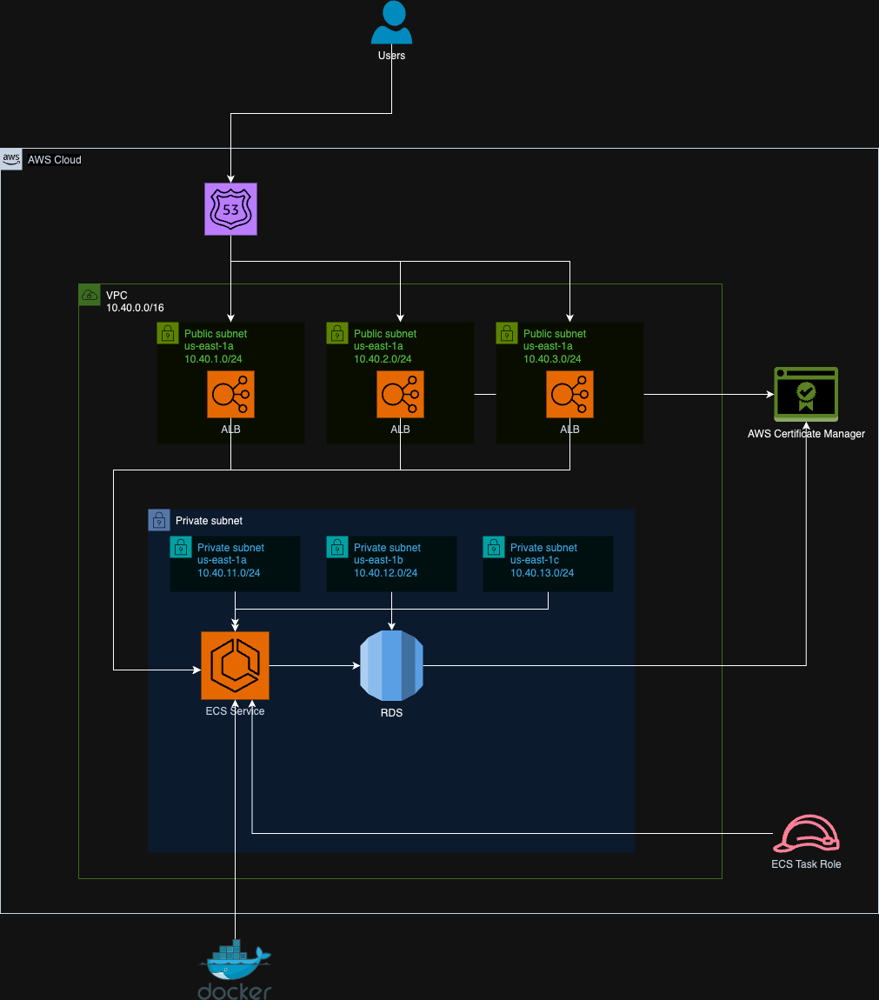

# Details of Test

In this file I'll try to explain in details some of the things I did while solving the test.

## Containerization

I'm using multi stage build to to minimize the size of the final image, including only the necessary to run the application.
Opted to use alpine images to reduce the attack surface and also reduce the image size.
Tried to use layers as much efficiently as possible. While some adittional optimizations could be done, like it's configured seems more organized without affecting the optimization.
I'm using a non-root user in the application runtime to avoid priviledge escalation.
Assigned explicit permissions to folders
By copying go.mod and go.sum before the rest of application we cache dependencies and speedup the subsequent builds that don't change the dependencies.
Passing variables with .env to avoid plain text although we can pass variables from github secrets per example when running in a pipeline.

## Local test

To build and test the application locally I did the following process.

Created a docker network to connect both DB and app:

`docker network create blockparty_network`

Connected postgres to the network:

`docker network connect blockparty_network postgres`

Built the nft_scraper image:

`docker build -t nft_scraper .`

Ran application:

`docker run --name nft_scraper_container --network blockparty_network -p 8080:8080 nft_scraper`

When starting the application I had an issue fetching a CID, which I'm sure the cause but maybe is not available anymore.

`2024/12/13 19:13:39 Failed to fetch metadata for CID bafkreicuerb3ixr7hni77pr6pnmsavadeshawnuwugy4umvswqstv55el9: failed to fetch metadata: 422 Unprocessable Entity`

But i was able to connect to the application and talk to the api and that was the output.

```json
[
    {
        "cid": "bafkreifovhtvvrx5jmo2b4ne2hoyk4t3c276jc7weva5s57ilupiiuqg2y",
        "name": "Angels In the Outfield #10/10",
        "image": "ipfs://QmXkqwHAc4C2u6Qu25een1ykHG2BCAxDoWHU1aWcaZJobj"
    },
    {
        "cid": "bafkreifwbyviygstiqmjcijju33r6scctuyxciqiepcrs2ym2bbpf7c7rq",
        "name": "Angels In the Outfield #9/10",
        "image": "ipfs://QmXkqwHAc4C2u6Qu25een1ykHG2BCAxDoWHU1aWcaZJobj"
    },
    {
        "cid": "bafkreicpcdl32e5l4kusphczsswo3wcrjo7fyt4iktgnhctdnhim6o3xwe",
        "name": "Angels In the Outfield #8/10",
        "image": "ipfs://QmXkqwHAc4C2u6Qu25een1ykHG2BCAxDoWHU1aWcaZJobj"
    },
    {
        "cid": "bafkreicjwnp5xostqloqtfbwawhzii7nekddbzppi77rqf4r4nw4wrsd4q",
        "name": "Angels In the Outfield #7/10",
        "image": "ipfs://QmXkqwHAc4C2u6Qu25een1ykHG2BCAxDoWHU1aWcaZJobj"
    },
    {
        "cid": "bafkreib7xfz4cyv7gp2enc3zcxj6us42dz3v6m6aan4abueqzudcfjvmby",
        "name": "Angels In the Outfield #6/10",
        "image": "ipfs://QmXkqwHAc4C2u6Qu25een1ykHG2BCAxDoWHU1aWcaZJobj"
    },
    {
        "cid": "bafkreih3ofrl5cdne3o7bmabuugi2scqbvk6pqxaskbl4irgi2i7345vvy",
        "name": "Stargazer #4/10",
        "image": "ipfs://QmeoQot7ohJDwNSEdVfWepkhiPCsh19ZJkoCvUJ2iZpCK4"
    },
    {
        "cid": "bafkreihztk3kzqfhasvow6elspu6vqurhc4xgxew6efa45cbftx5vo3li4",
        "name": "Stargazer #3/10",
        "image": "ipfs://QmeoQot7ohJDwNSEdVfWepkhiPCsh19ZJkoCvUJ2iZpCK4"
    },
    {
        "cid": "bafkreifzz3xqlmxuk2mapgrv532jryigp5aqgoas6r7eksfl7ccvfsc3ge",
        "name": "Fun In The Sun #5/10",
        "image": "ipfs://QmZcinYJV2vmcpCETTEa3FpBHHh3PrucopvnseUUJr3GuG"
    },
    {
        "cid": "bafkreiekw2qbsfx7s7lyzcoabyskdpheteab3ogzzcrxboqzydv6fqhix4",
        "name": "In A Crowded Room #2/10",
        "image": "ipfs://QmPHwRr8mumB7MuXuLUGYayH1RTGGy9GSUY7uRdv3kTAX2"
    },
    {
        "cid": "bafkreieizajnzclz3fda52pmsdb7yxaf73aszq6kakqntpmawfa5bhvfau",
        "name": "Basement Show #1/10",
        "image": "ipfs://QmeZDh95PWw7He7fAmTN7sKynZ4eRmWzp85Skq3o8Ph4Hh"
    },
    {
        "cid": "bafkreicuerb3ixr7hni77pr6pnmsavades3wxcuwugy4umvsjqstvpoelu",
        "name": "Basement Show #7/10",
        "image": "ipfs://QmeZDh95PWw7He7fAmTN7sKynZ4eRmWzp85Skq3o8Ph4Hh"
    },
    {
        "cid": "bafkreieuhkm2v4gzhuf52cfi2ob47ve4p6lo25rlbk7ckrc4sywivc2npi",
        "name": "VAGABONDS: Men of the Hour #1/10",
        "image": "ipfs://QmY4HoY3bn7ijhJ3ReZtJMKKVw7iE9xwW4xN2tADUe1y3F"
    },
    {
        "cid": "bafkreigfin2zgkd45bdelxxmizpa7dvuvgelvxd5oodexc52uruu3cg4pi",
        "name": "VAGABONDS: Men of the Hour #4/10",
        "image": "ipfs://QmY4HoY3bn7ijhJ3ReZtJMKKVw7iE9xwW4xN2tADUe1y3F"
    },
    {
        "cid": "bafkreihjkq3w2gkplz2fclroceqco7nit4ekquhnvfbj7iikt6izuswlva",
        "name": "Lunch Break #4/16",
        "image": "ipfs://QmcrmUtAu5L9WpJUsc2uz3wPEDeeDxw9YYN3mVZtFREY6d"
    },
    {
        "cid": "bafkreibwqdysbhjc4uwratubu5dpsolcnyx7mo3pwey7gfnbhm2wo2eoze",
        "name": "Hope #11/16",
        "image": "ipfs://QmUtEhkPW6HR1BHcMSZEmi8RkxuoPHKj9fE96uQmM17gRU"
    },
    {
        "cid": "bafkreigt5pduy2qtxou3nvfuwq4xyfziawgse7bwzj5pjfesnhg6kvaj7y",
        "name": "Look Up #3/16",
        "image": "ipfs://QmPw1CpWQ4Wz61dED4mqJsyLZfysUgnAvvvdj7sBTwCHsJ"
    },
    {
        "cid": "bafkreig4qyrpmt2gmvfcxnz4gqbodxjp2dsy6sgllkupnup4gys7wqnt2y",
        "name": "little star #16/16",
        "image": "ipfs://QmZATqtH66TeyEN5vswb2wfonThfdiadH61xeCfqjPoWQP"
    },
    {
        "cid": "QmamdCZfHLy18hAix12h7ntu41vNjjMGQCj2gEqijiEcRs",
        "name": "Fraction 242",
        "image": "https://piqsol.mypinata.cloud/ipfs/QmZ1DpFEfZQxEJqmKTcxuzeMQ8raNXgaots1B2eEyJ5obi"
    },
    {
        "cid": "bafkreibrdju7aievsss6lq2iem3kzqvskz6ig3zk2psdfy7bejhdp72qzy",
        "name": "Flower from Carina MP4 - v3 #17",
        "image": "ipfs://QmRbKmJpsJ5Am6jMsrVxmKDKyS5r9qKxxe9NNMbKwfBVJZ"
    },
    {
        "cid": "bafkreiailk323slyxvcrc7k3gofhtnsp7d6k5s5c2li3fa3uscur5yznlm",
        "name": "Flower from Carina MP4 - v3 #13",
        "image": "ipfs://QmRbKmJpsJ5Am6jMsrVxmKDKyS5r9qKxxe9NNMbKwfBVJZ"
    },
    {
        "cid": "QmT3Xz6QBLLre9KfCLthUWVjZAHhMzFDx34MiSKaoUh3pi/1464.json",
        "name": "Rudolph #1464",
        "image": "https://ipfs.filebase.io/ipfs/QmfGhrvQjBhmNGLRRprd7H6oXwQ1tvWpkvB4SbAy4qhf3M/1464.png"
    },
    {
        "cid": "bafybeia67q6eabx2rzu6datbh3rnsoj7cpupudckijgc5vtxf46zpnk2t4/3885",
        "name": "Fragments by James Jean #3885",
        "image": "ipfs://bafybeie7u4i4yyqzw37jjuaa4zteyf3xnxirokktpncty2b3y47i5sfaya"
    }
]
```

## CICD

In order to build the pipeline the dockerfile had to be modified to accept ARGS and ENVS that way we pass in sensitive information like, DB credentials, securily.

For that part I used a few actions that helps with the tasks and reduce the amount of code needed.

We could add more complexity like different environments and tagging them with `${github.sha}` per example, while leaving the prod environment with the latest tag, but that will too long, so I thought would be better to explain here the ideal scenario.

Another thing we should do was also run some tests in the pipeline to make sure the build is good to be published, but that would also consume a considerable amount of time specially because I don't have an environment to test that without spending money.

Ideally I would also push the image to ECR, but for the same monetary reason, I avoided that for the exam.

## IaC

Ideally I would use terragrunt to create the structure, it's a tool that I have a lot of familiarity, but that would take more time to finish.

But I developed a way to simulate some aspects of terragrunt using pure terraform, which consists in splitting the state files in smaller files for better state management. Another thing is that I make use of backend files for each environment, so we can reuse the same code for all the environments.

## Terraform Usage

Terraform has been setup in a way it can be reused for different environments if needed. This is achieved by using backend files and terraform workspaces. This setup is also usefull because generates separate state files, facilitating and speeding up the process of making changes to the infrastructure, because you don't need to apply all the code eveytime you need to make a change, it's a similar principle of how terragrunt manage the states.

The variables are configured inside the config folder, that means if we create different config files new environments will be created using the same code.

In this setup, to be able to start using terraform, the state bucket needs to be created, for that the code inside `terraform/init` folder must be executed before anything else with these commands:

0. Set your AWS credentials using you preffered method (e.g `export AWS_PROFILE=<your-profile-name>`)
1. `export TF_WORKSPACE=production` (if using task this step is not needed).
2. `terraform init` or `task init-state-bucket`
3. `terraform plan` or `task plan-state-bucket`
4. `terraform apply` or `task apply-state-bucket`

To use this setup manually you can use these commands if you want to execute the code, it's important to follow this order to avoid unexpected errors:

0. Set your AWS credentials using you preffered method (e.g `export AWS_PROFILE=<your-profile-name>`)
1. `export TF_WORKSPACE=development` (if using task this step is not needed)
2. `terraform init -backend-config=backend-"$TF_WORKSPACE".hcl`
3. `terraform plan -var-file=backend-"$TF_WORKSPACE".hcl`
4. `terraform apply -var-file=backend-"$TF_WORKSPACE".hcl`

As we are creating splitted state files for better management the order of the modules matter, specially if we are using dependencies from others. For this setup I removed any dependencies and that is one of the reasons the apply would not work, but anyways, make sure you follow this order to plan the modules:

1. VPC
2. ECS
3. RDS
4. ECS_SERVICE

To facilitate the process I created a Taskfile with automated tasks, if you run those tasks in this order you will be able to test the terraform code.

To run the taskfile please install task app first
* https://taskfile.dev/installation/
* On mac use: `brew install go-task/tap/go-task`

Tasks:

1. `task init-state-bucket`
2. `task plan-state-bucket`
3. `task apply-state-bucket`
4. `task dev-init-all`
5. `task dev-plan-all`

**The apply is not fully working because would incur in charges on my account, a few tweaks would be needed in order to be able to apply.**

## Architecture Diagram

